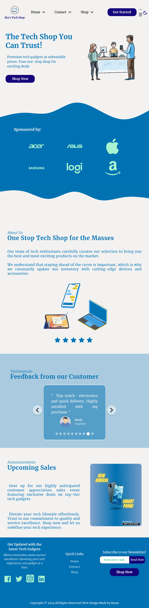
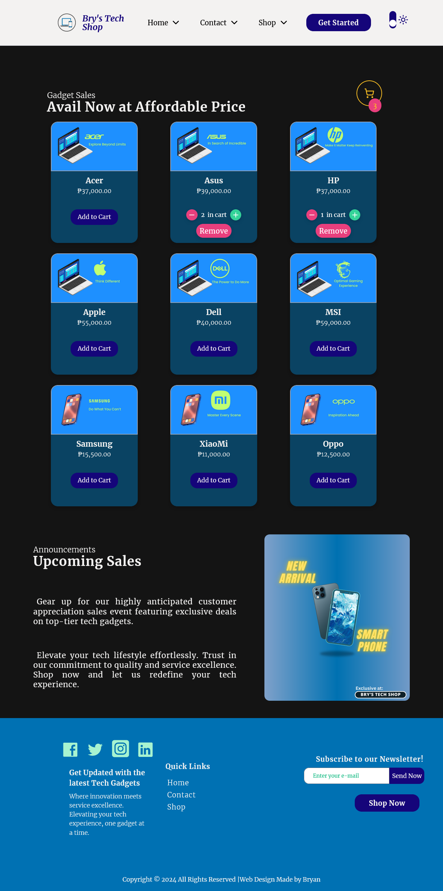

## E-commerce Website Project

Tech Stacks:

Concepts Learned During Development:

- TypeScript Data Types Declaration
- Enable Absolute Path Directory Setup
- Tailwind's Utility Based Styling
- Responsive Web Design (Mobile-First Approach)
- React Router Set Up
- State Managements (Virtual DOM Manipulation)
- UseEffect Hook for External API Data Fetching
- Context API
- Form Validation
- Online Shopping Cart Mechanism

Project Demo

### Landing Page

### Shopping Page

